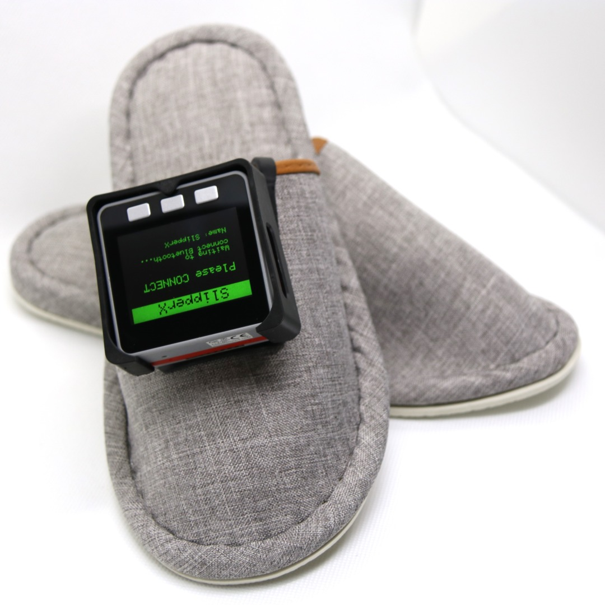
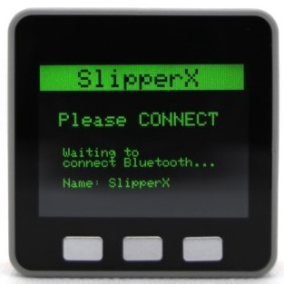
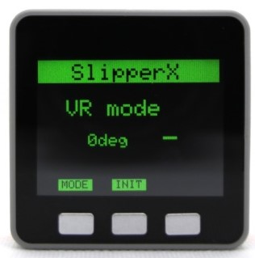
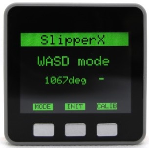
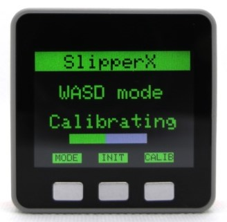

# SlipperX ユーザーガイド

SlipperXの使用方法を説明します。

## 各部の名称

SlipperXの各部名称を説明します。

## Bluetoothのペアリング方法

パソコンとのペアリング方法を記載します。

1. SlipperXの電源ボタンを押して「Please CONNECT」の画面になるまで待ちます（約3秒）
    
1. パソコンの「設定」→「デバイス」→「Bluetooth とその他のデバイス」画面からBluetooth設定を有効にします
1. 「Bluetooth またはその他のデバイスを追加する」をクリックします
    
1. Bluetoothを選択し、表示されている「SlipperX」を選択する
    
1. VRモード画面になれば使用準備OK！
    

## 地磁気センサのキャリブレーション方法

SlipperXを新しい場所で使用する場合は、地磁気センサのキャリブレーションが必要です。

1. SlipperXの電源ボタンを押して「VR mode」の画面になるまで待つ
    ※「Please CONNECT」画面が継続する場合は、再度ペアリングを実施してください
1. 「MODE」ボタンを押して、「WASD mode」の画面に切り替える
    
1. 「CALIB」ボタンを押して、SlipperXを8の字を描くように動かす
    

## VRモードの使用方法

1. SlipperXをはく
    ★SlipperXをはいた写真
1. SlipperXの電源ボタンを押して「VR mode」の画面になるまで待つ
    ※起動中は、SlipperXを動かさないでください（重力加速度の方向を校正しているため）
    ※「Please CONNECT」画面が継続する場合は、再度ペアリングを実施してください
    ★「VR mode」の画面
1. パソコンで使いたいアプリ（VRChat等）のウインドウを選択して最前面にする
1. 足踏みをすると、"w"キーが入力されて前進することができます
1. 足を前後に振ると、"s"キーが入力されて後進することができます

## WASDモードの使用方法

1. SlipperXをはく
    ★SlipperXをはいた写真
1. SlipperXの電源ボタンを押して「VR mode」の画面になるまで待つ
    ※起動中は、SlipperXを動かさないでください（重力加速度の方向を校正しているため）
    ※「Please CONNECT」画面が継続する場合は、再度ペアリングを実施してください
1. 「MODE」ボタンを押して、「WASD mode」の画面に切り替える
    ★「WASD mode」の画面
1. パソコンで使いたいアプリ（PCゲーム等）のウインドウを選択して最前面にする
1. その場で足踏みをすると、"w"や"W"のキーが入力されて前進することができます
1. 左を向いて足踏みをすると、"a"や"A"のキーが入力されて左に移動することができます
1. 右を向いて足踏みをして、"d"や"D"のキーが入力されて右に移動することができます
1. 足を前後に振ると、"s"や"S"キーが入力されて後進することができます
1. 足を左右に振ると、スペースキーが入力されて対応するアクション（ジャンプなど）を実行することができます
1. 中央の「INIT」ボタンを押すと、今向いている角度をゼロ（前方）に設定することができます

★足を振る方向とキー入力の対応を示した絵

## VRChatでの遊び方

1. SteamVRでVRChatを起動する
1. SlipperXをはく
1. SlipperXの電源ボタンを押して「VR mode」の画面になるまで待つ
    ※起動中は、SlipperXを動かさないでください（重力加速度の方向を校正しているため）
1. 足踏みをすると、VRChat内で移動できればOK
