# SlipperX ユーザーガイド

SlipperXの使用方法を紹介します。

## 1. 目次

- [SlipperX ユーザーガイド](#slipperx-ユーザーガイド)
  - [1. 目次](#1-目次)
  - [2. 各部の名称](#2-各部の名称)
  - [3. 初期設定](#3-初期設定)
    - [3.1. Bluetoothのペアリング方法](#31-bluetoothのペアリング方法)
    - [3.2. 地磁気センサのキャリブレーション方法](#32-地磁気センサのキャリブレーション方法)
  - [4. 遊び方](#4-遊び方)
    - [4.1. VRモードの使用方法](#41-vrモードの使用方法)
    - [4.2. WASDモードの使用方法](#42-wasdモードの使用方法)
    - [4.3. 再起動方法](#43-再起動方法)
    - [4.4. 電源の切り方](#44-電源の切り方)
    - [4.5. 充電方法](#45-充電方法)
  - [5. 動作モード説明](#5-動作モード説明)
    - [5.1. VRモード](#51-vrモード)
    - [5.2. WASDモード](#52-wasdモード)

## 2. 各部の名称

各部の名称を図示します。

| 名称 | 説明 |
| ---- | ---- |
| 電源ボタン | 1回押し：起動又は再起動、2回押し：スリープ |
| TypeCコネクタ | 充電用TypeCコネクタ |
| MODEボタン | 動作モード切替ボタン |
| INITボタン | 現在の方向を0°に初期化するボタン |
| CALIBボタン | 地磁気センサのキャリブレーションを開始するボタン |

## 3. 初期設定

### 3.1. Bluetoothのペアリング方法

パソコンとのペアリング方法を記載します。

1. SlipperXの電源ボタンを押して「Please CONNECT」の画面になるまで待ちます

    

1. パソコンの「設定」→「デバイス」→「Bluetooth とその他のデバイス」画面からBluetooth設定を有効にします

1. 「Bluetooth またはその他のデバイスを追加する」をクリックします

    

1. Bluetoothを選択し、表示されている「SlipperX」を選択します

    

1. SlipperXの画面が「Please CONNECT」画面から「VR mode」画面になれば、使用準備OKです

### 3.2. 地磁気センサのキャリブレーション方法

SlipperXをWASDモードで使用する場合は、はじめに地磁気センサのキャリブレーションが必要です。\
※一度実施した後も、SlipperXを使用する場所が変わった場合は、再度キャリブレーションが必要な場合があります

1. SlipperXの電源ボタンを押して「VR mode」の画面になるまで待ちます

    ※「Please CONNECT」画面が継続する場合は、ペアリングを実施してください

1. 「MODE」ボタンを押して、「WASD mode」の画面に切り替えます

1. 「CALIB」ボタンを押して、SlipperXを8の字を描くように複数回動かします

    

    

## 4. 遊び方

### 4.1. VRモードの使用方法

1. SlipperXをはきます

1. SlipperXの電源ボタンを押して「VR mode」の画面になるまで待ちます\
    ※起動中は、SlipperXを動かさないでください（重力加速度の方向を取得するため）\
    ※「Please CONNECT」画面が継続する場合は、再度ペアリングを実施してください

1. パソコンで、遊びたいアプリ（例えばSteamVRのVRChatなど）を起動し、ウインドウを最前面にします\
    ※キーボード入力でキャラクターを動かすため、SteamVR等のPCを介したVRの使用が前提となっています\
    ※アプリを最前面（アクティブな状態）にすることで、SlipperXの入力が有効になります

1. 足踏みをすると、前進することができます\
    ※詳細な操作方法は「[5.1. VRモード](#51-vrモード)」を参照してください

### 4.2. WASDモードの使用方法

1. SlipperXをはきます

1. SlipperXの電源ボタンを押して「VR mode」の画面になるまで待ちます\
    ※起動中は、SlipperXを動かさないでください（重力加速度の方向を取得するため）\
    ※「Please CONNECT」画面が継続する場合は、再度ペアリングを実施してください

1. 「MODE」ボタンを押して、「WASD mode」の画面に切り替えます

1. パソコンで使いたいアプリ（PCゲーム等）のウインドウを選択して最前面にします

1. 足踏みをすると、前進することができます\
    ※詳細な操作方法は「[5.2. WASDモード](#52-wasdモード)」を参照してください

1. 中央の「INIT」ボタンを押すと、今向いている方向をゼロ（前方）に設定することができます

    

### 4.3. 再起動方法

SlipperXの電源ボタンを1回押します

### 4.4. 電源の切り方

SlipperXの電源ボタンを素早く2回押します\
※厳密には電源OFFではなく、ディープスリープに移行します

### 4.5. 充電方法

TypeCコネクタにUSB Type-Cケーブル（5V@500mA）を接続します。

## 5. 動作モード説明

### 5.1. VRモード

VRChatなどのVRゲームを想定したモードです。

前進はSlipperX、進行方向は頭の向き（VRゴーグル）で移動します。\
SlipperXを動かす方向に対応するキー出力を以下の表に記載します。

### 5.2. WASDモード

着座でのPCゲームでの使用を想定し、歩行に合わせて"W","A","S","D"といった前後左右の移動入力が行えます。

進行方向を足の向きで検知します。\
SlipperXを動かす方向と向き、および動作頻度に対応するキー出力を以下の表に記載します。

